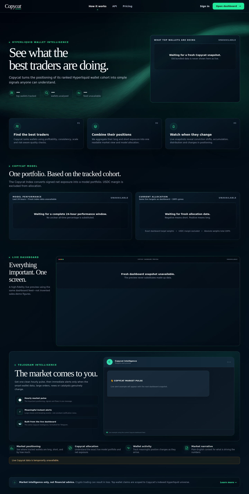

# Copycat

**A live Hyperliquid data product that turns the positioning of consistently strong wallets into a market view that is actually readable.**



## Why I built it

I kept seeing crypto dashboards that basically answered **which wallet is biggest?** or **who has made the most money?** That is interesting, but it does not automatically tell you whether a group of good traders actually agrees on anything right now.

I wanted to see if I could build something that answered a more useful question:

> **What are consistently profitable Hyperliquid wallets doing right now, and where do they genuinely agree?**

That became Copycat.

## How it works in plain English

1. **Find active wallets.** Copycat discovers wallets from Hyperliquid market activity and keeps its own local registry.
2. **Check their history.** It looks at trading history, fills, fees, funding, consistency and minimum-history rules rather than trusting a leaderboard position on its own.
3. **Choose the live cohort.** The best qualified wallets from the indexed universe are selected for live monitoring.
4. **Make the wallets comparable.** A huge wallet should not automatically overpower a smaller but consistently good one, so each position is measured against that wallet's own perpetual-account equity and each wallet's total contribution is capped.
5. **Let disagreement cancel out.** If strong wallets are split between long and short on the same asset, the model reduces or removes that signal rather than pretending there is conviction.
6. **Publish the result.** The remaining consensus becomes asset signals, long/short exposure, a model portfolio and a synthetic Copycat Index, with read-only snapshots feeding the public interface.

The simple version is: **find good traders → make their positions comparable → cancel the noise → show what is left.**

## What I was responsible for

I came up with what the product should do, how the ranking and consensus should behave, what the dashboard needed to explain and the rules I wanted the data to follow.

A big part of the project has been checking whether the numbers mean what the interface says they mean. For example, I have had to separate total wallet value from perpetual-account equity, fix cases where token pricing could inflate wallet values, make the dashboard and API use the same selected-wallet source and rework the portfolio logic so opposing positions actually cancel.

That validation side is probably the best description of how I work on projects like this: **decide what the system is supposed to mean, test the output, find where reality does not match the intention, then keep refining it.**

### How I use AI

I use AI heavily for implementation. I am not claiming I manually wrote every line of Python or TypeScript in this repository.

What I own is the **product idea, requirements, scoring and data rules, dashboard behaviour, validation, QA and the decisions about what the result should mean**. I use AI to get from those decisions to working software much faster, then I review the output against the actual product logic rather than assuming generated code is right.

For me, the useful skill is not pretending AI was not involved. It is being able to take an idea, make the requirements specific enough to build, spot when the output is wrong and get it to a working result.

## What the project demonstrates

- Turning a vague question into measurable rules and a working data product.
- Designing KPIs and scoring rather than just displaying raw API data.
- Working with messy live data and distinguishing similar-looking measures that mean different things.
- Building validation and data-quality checks around a dashboard.
- Automating data collection, ranking, publishing and alerting.
- Explaining a reasonably complicated model in normal language.
- Using AI-assisted development while still owning the product decisions and QA.

## The consensus model

Each selected wallet is treated as a source of information rather than being weighted purely by account size.

For each wallet:

1. Position value is divided by the wallet's perpetual-account equity.
2. Total contribution is capped so one wallet cannot dominate the result.
3. Higher-ranked wallets get a small additional influence.
4. Long and short positions in the same asset cancel each other.
5. Assets need participation from multiple wallets and a minimum level of agreement.
6. Stablecoins are excluded from directional allocation.
7. The remaining asset scores are normalised into portfolio weights.

So if the selected cohort is only long BTC, the model can end up heavily or entirely allocated to BTC. If it is roughly 51% long and 49% short, that is disagreement, not a strong BTC signal, and the allocation should be tiny or zero.

## Architecture

```text
Hyperliquid public APIs
        ↓
Wallet discovery + registry
        ↓
Historical quality analysis
        ↓
Qualified live wallet cohort
        ↓
Local snapshot publisher
        ↓
Consensus index / asset signals / exposure / data-quality checks
        ↓
Cloudflare R2 read-only JSON snapshots
        ↓
Next.js public interface
```

**Main tools:** Python, TypeScript, Next.js, React, Hyperliquid public APIs, SQLite, Cloudflare R2 / Pages, PowerShell automation and GitHub Actions.

## Things I do not want the project to pretend

- This is **not** a historical backtest proving the strategy would have made a particular return.
- Public Hyperliquid history has limits, so a wallet can be excluded when there is not enough history to verify it properly.
- The selected cohort is the best qualified set from Copycat's indexed universe, not a claim that these are definitively the best wallets on the entire platform.
- The Copycat Index is synthetic and informational. It does not include execution costs, slippage or guaranteed tradability.
- Nothing in the project is financial advice.

## Portfolio case study

[`docs/PORTFOLIO_CASE_STUDY.md`](docs/PORTFOLIO_CASE_STUDY.md) goes into more detail on the problems I found while building it, why I changed the model and how I validated the results.

<details>
<summary><strong>Running locally</strong></summary>

```bash
cd frontend
npm install
npm run dev
```

Copy the relevant `.env.example` file to its local non-example filename and replace placeholder values. Real credentials, bot tokens, wallet keys, local databases and runtime output should never be committed.

The local snapshot publisher has its own example configuration at:

```text
scripts/local_snapshot_publisher/publisher.env.example
```

</details>

## Ownership

Copyright © 2026 Paul Murrin. All rights reserved. No open-source licence is granted unless a separate `LICENSE` file is added.
